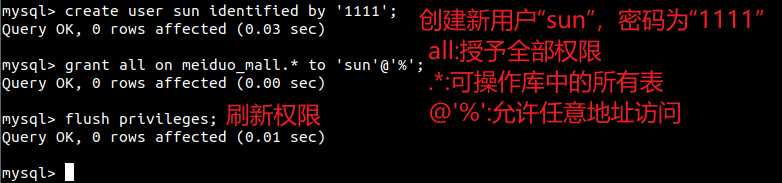
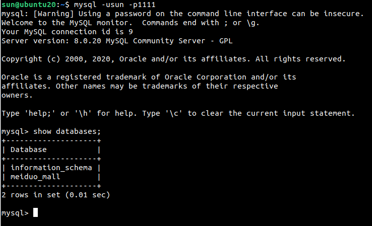

[TOC]
# 换用MySQL数据库

## 配置位置
在settings.py中保存了数据库的连接配置信息，Django默认初始配置使用sqlite数据库。
```python
DATABASES = {
    'default': {
        'ENGINE': 'django.db.backends.sqlite3',
        'NAME': os.path.join(BASE_DIR, 'db.sqlite3'),
    }
}
```

## 更换数据库
### 1. 在数据库中创建名为`book`的数据库
```sql
create database book charset=utf8;
```
### 2. 修改配置信息
替换为MySQL数据库，只需要修改配置信息即可。当然，能使用的前提是MySQL已经安装并运行。
```python
DATABASES = {
    'default': {
        'ENGINE': 'django.db.backends.mysql',
        'HOST':'127.0.0.1',
        'PORT':3306,
        'USER':'root',
        'PASSWORD':'1112',
        'NAME': 'book',
    }
}
```

### 3. 新建用户并授权

##### 创建新用户
```sql
create user sun identified by '1111';
```

##### 授权
```sql
grant all on meiduo_mall.* to 'sun'@'%';
```

##### 刷新权限
```sql
flush privileges;
```

  

##### 检查是否生效
  
