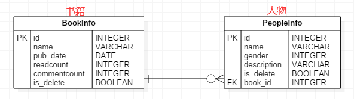

[TOC]

# 定义模型类
+ 在“应用/models.py”文件中定义模型类
+ 模型类必须继承Model类，Model类位于包django.db.models中

以“图书-人物”管理为例进行演示。
  

### 1. 定义模型类
在models.py 文件中定义模型类。
```python
from django.db import models

# Create your models here.
# 准备书籍列表信息的模型类
class BookInfo(models.Model):
    # 创建字段，字段类型...
    name = models.CharField(max_length=10, unique=True)
    pub_date = models.DateField(null=True)
    readcount = models.IntegerField(default=0)
    commentcount = models.IntegerField(default=0)
    is_delete = models.BooleanField(default=False)

    class Meta:
        db_table = 'bookinfo'  # 修改表的名字
        verbose_name = '书籍管理'  # admin站点使用的（了解）

    def  __str__(self):
        return self.name


class PeopleInfo(models.Model):
    # 定义一个有序字典
    GENDER_CHOICE = (
        (1, 'male'),
        (2, 'female')
    )

    name = models.CharField(max_length=10, unique=True)
    gender = models.SmallIntegerField(choices=GENDER_CHOICE, default=1)
    description = models.CharField(max_length=100, null=True)
    is_delete = models.BooleanField(default=False)

    # 外键
    # 系统会自动为外键添加 _id
    # 外键的级联操作
    # 主表 和 从表
    # 1 对 多
    # 书籍    对  人物
    # 主表的一条数据 如果删除了
    # 从表有关联的数据， 关联的数据怎么办呢？？？
    # SET_NULL 设置为null
    # PROTECT 抛出异常，不让删除
    # CASCADE 级联删除
    book = models.ForeignKey(BookInfo, on_delete=models.CASCADE)

    class Meta:
        db_table = 'peopleinfo'

    def __str__(self):
        return self.name

```

#### 1) 修改数据库表名
模型类如果未指明表名，Django默认以小写app应用名_小写模型类名为数据库表名。

可通过db_table指明数据库表名。
```python
class Meta:
    db_table = 'peopleinfo'
    verbose_name = '人物信息'
```

#### 2) 关于主键
django会为表创建自动增长的主键列，每个模型只能有一个主键列，如果使用选项设置某属性为主键列后django不会再创建自动增长的主键列。

默认创建的主键列属性为id，可以使用pk代替，pk全拼为primary key。

#### 3) 属性命名限制
+ 不能是python的保留关键字。
+ 不允许使用连续的下划线，这是由django的查询方式决定的。
+ 定义属性时需要指定字段类型，通过字段类型的参数指定选项，语法如下：
    >属性=models.字段类型(选项)
    ```python
    name = models.CharField(max_length=20, verbose_name='名称')
    ```

#### 4) 字段类型

| 类型 | 说明 |
| ------ | ------ |
| AutoField | 自动增长的`IntegerField`，通常不用指定，不指定时Django会自动创建属性名为id的自动增长属性 |
| BooleanField | 布尔字段，值为True或False |
| NullBooleanField | 支持Null、True、False三种值 |
| CharField | 字符串，参数max_length表示最大字符个数 |
| TextField | 大文本字段，一般超过4000个字符时使用 |
| IntegerField | 整数 |
| DecimalField | 十进制浮点数， 参数`max_digits`表示总位数， 参数`decimal_places`表示小数位数 |
| FloatField | 浮点数 |
| DateField | 日期， 参数`auto_now`表示每次保存对象时，自动设置该字段为当前时间，用于"最后一次修改"的时间戳，它总是使用当前日期，默认为False;<br/>参数`auto_now_add`表示当对象第一次被创建时自动设置当前时间，用于创建的时间戳，它总是使用当前日期，默认为False;<br/>参数auto_now_add和auto_now是**相互排斥**的，组合将会发生错误 |
| TimeField | 时间，参数同`DateField` |
| DateTimeField | 日期时间，参数同`DateField` |
| FileField | 上传文件字段 |
| ImageField | 继承于`FileField`，对上传的内容进行校验，确保是有效的图片 |

#### 5) 选项
| 选项 | 说明 |
| ------ | ------ |
| null | 如果为True，表示允许为空，默认值是False |
| blank | 如果为True，则该字段允许为空白，默认值是False |
| db_column | 字段的名称，如果未指定，则使用属性的名称 |
| db_index | 若值为True, 则在表中会为此字段创建索引，默认值是False |
| default | 默认 |
| primary_key | 若为True，则该字段会成为模型的主键字段，默认值是False，一般作为AutoField的选项使用 |
| unique | 如果为True, 这个字段在表中必须有唯一值，默认值是False |

**null是数据库范畴的概念，blank是表单验证范畴的**

#### 6) 外键
在设置外键时，需要通过on_delete选项指明主表删除数据时，对于外键引用表数据如何处理，在django.db.models中包含了可选常量：
- **CASCADE** 级联，删除主表数据时连通一起删除外键表中数据
- **PROTECT** 保护，通过抛出**ProtectedError**异常，来阻止删除主表中被外键应用的数据
- **SET_NULL** 设置为NULL，仅在该字段null=True允许为null时可用
- **SET_DEFAULT** 设置为默认值，仅在该字段设置了默认值时可用
- **SET()** 设置为特定值或者调用特定方法
- **DO_NOTHING** 不做任何操作，如果数据库前置指明级联性，此选项会抛出**IntegrityError**异常

### 2. 迁移
将模型类同步到数据库中。
#### 1) 生成迁移文件
  ```
  python manage.py makemigrations
  ```
#### 2) 同步到数据库中
  ```
  python manage.py migrate
  ```
