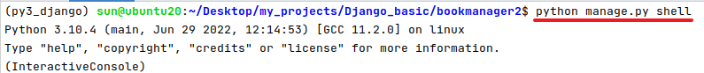
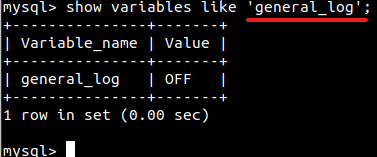
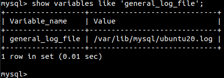
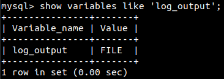
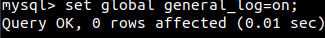
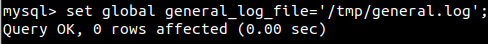
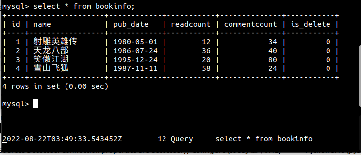

[TOC]

# shell工具和查看MySQL数据库日志

## 1 shell工具
Django的manage工具提供了shell命令，帮助我们配置好当前工程的运行环境（如连接好数据库等），以便可以直接在终端中执行测试python语句。

通过如下命令进入shell
```python
python manage.py shell
```
  

导入两个模型类，以便后续使用
```python
from book.models import BookInfo,PeopleInfo
```

## 2 查看MySQL数据库日志(结果集特性使用)

### 查看日志状态与修改配置
#### 查看状态
使用 `show variables like 'general_log';` 查看日志是否开启
  

使用 `show variables like 'general_log_file';` 查看日志保存位置
  

使用 `show variables like 'log_output';` 查看日志输出类型 table和file两种类型
  

`log_output=’FILE’` 表示将日志存入文件,默认值是FILE;
`log_output=’TABLE’` 表示将日志存入数据库,这样日志信息就会被写入到mysql.slow_log表中;
mysql数据库支持同时两种日志存储方式,配置的时候以逗号隔开即可,如:`log_output='FILE,TABLE'`;
日志记录到系统专用日志表中,要比记录到文件耗费更多的系统资源,因此对于需要启用慢查日志,又需要比够获得更高的系统性能,那么建议优先记录到文件。

#### 修改配置
使用 `set global general_log=on;` 开启general_log日志
  

使用 `set global general_log_file='/tmp/general.log';` 指定日志输出位置
  


永久修改需要在`my.cnf`中`[mysqld]`添加
```
general_log = 1
general_log_file=/tmp/general.log
```

#### 查看日志
使用 `tail` 命令可以实时监控日志文件的变化
> tail -f general.log

  

当在`MySQL`控制台执行指令，general.log会实时记录执行的指令
  
