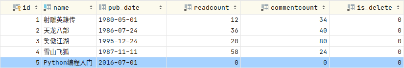
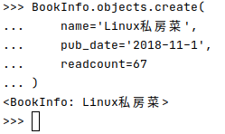
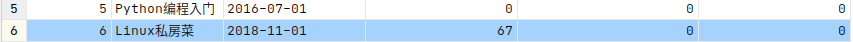
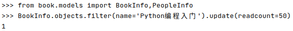
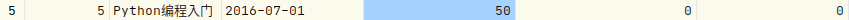

[TOC]
# 数据库操作
## 1. 增
增加数据有两种方法。
##### 1) save
通过创建模型类对象，执行对象的`save()`方法保存到数据库中。
```python
book = BookInfo(
    name='Python编程入门',
    pub_date='2016-7-1'
)
book.save()
```
.png)  

  

##### 2) `模型类.objects.create()`
通过`模型类.objects.create()`保存。
```python
BookInfo.objects.create(
    name='Linux私房菜',
    pub_date='2018-11-1',
    readcount=67
)
```
  
  

## 2. 改
修改更新有两种方法
##### 1) save
修改模型类对象的属性，然后执行save()方法
```python
book = BookInfo.objects.get(name='Python编程入门')
book.readcount = 100
book.save()
```
.png)  
结果.png)  

##### 2) `模型类.objects.filter().update()`
使用`模型类.objects.filter().update()`，会返回受影响的行数
```python
BookInfo.objects.filter(name='Python编程入门').update(readcount=50)
```
  
  

## 3. 删
删除有两种方法
##### 1) `模型类对象.delete()`
```python
book = BookInfo.objects.get(name='Python编程入门')
book.delete()
```
.png)  

##### 2) `模型类.objects.filter().delete()`
```python
BookInfo.objects.filter(name='Linux私房菜').delete()
```
.delete().png)  

## 4. 查


