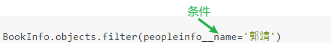

[TOC]
# 级联查询
## 1.关联查询
### 由一到多的访问语法
在**一对多**的关系中，如何由**一**获取到**多**的信息？
答：Django框架在**一**的模型中，自动添加了`一对应的模型类对象.多对应的模型类名小写_set`字段，该字段保存了所有**多**的信息。

例：查询书籍为1的所有人物信息
```python
>>> BookInfo.objects.get(id=1).peopleinfo_set.all()
<QuerySet [<PeopleInfo: 郭靖>, <PeopleInfo: 黄蓉>, <PeopleInfo: 黄药师>, <PeopleInfo: 欧阳锋>, <PeopleInfo: 梅超风>]>
```
查看MySQL的日志，可以看到，实际执行的sql语句为：
```sql
SELECT `peopleinfo`.`id`, `peopleinfo`.`name`, `peopleinfo`.`gender`, `peopleinfo`.`description`, `peopleinfo`.`is_delete`, `peopleinfo`.`book_id` FROM `peopleinfo` WHERE `peopleinfo`.`book_id` = 1  LIMIT 21
```
与使用`PeopleInfo.objects.filter(book__id='1')`查询时实际执行的sql语句相同

### 由多到一的访问语法
`多对应的模型类对象.多对应的模型类中的关系类属性名`
例：查询人物为1的书籍信息
```python
>>> PeopleInfo.objects.get(id=1).book
<BookInfo: 射雕英雄传>
```

访问一对应的模型类关联对象的属性语法:
`多对应的模型类对象.关联类_属性`

例：查看id为1的人物所在书籍的id
```python
>>> PeopleInfo.objects.get(id=1).book_id
1
```
```sql
SELECT `peopleinfo`.`id`, `peopleinfo`.`name`, `peopleinfo`.`gender`, `peopleinfo`.`description`, `peopleinfo`.`is_delete`, `peopleinfo`.`book_id` FROM `peopleinfo` WHERE `peopleinfo`.`id` = 1
```

## 2.关联过滤查询
#### 由 **多模型类条件** 查询 **一模型类数据**:
语法如下：
```
关联模型类名小写__属性名__条件运算符=值
```

例：查询图书，要求图书人物为"郭靖"
```python
>>> BookInfo.objects.filter(peopleinfo__name='郭靖')
<QuerySet [<BookInfo: 射雕英雄传>]>
```

  

实际执行的sql：
```sql
SELECT `bookinfo`.`id`, `bookinfo`.`name`, `bookinfo`.`pub_date`, `bookinfo`.`readcount`, `bookinfo`.`commentcount`, `bookinfo`.`is_delete`
FROM `bookinfo` INNER JOIN `peopleinfo` ON (`bookinfo`.`id` = `peopleinfo`.`book_id`) 
WHERE `peopleinfo`.`name` = '郭靖'  
LIMIT 21
```

例：查询图书，要求图书中人物的描述包含"八"
```python
>>> book = BookInfo.objects.filter(peopleinfo__description__contains='八')
>>> book
<QuerySet [<BookInfo: 射雕英雄传>, <BookInfo: 天龙八部>]>
```

#### 由 **一模型类条件** 查询 **多模型类数据**:

语法如下：
```
一模型类关联属性名__一模型类属性名__条件运算符=值
```

例：查询书名为“天龙八部”的所有人物。
```python
>>> people = PeopleInfo.objects.filter(book__name='天龙八部')
>>> people
<QuerySet [<PeopleInfo: 乔峰>, <PeopleInfo: 段誉>, <PeopleInfo: 虚竹>, <PeopleInfo: 王语嫣>]>
```

例：查询图书阅读量大于30的所有人物
```python
>>> people = PeopleInfo.objects.filter(book__readcount__gt=30)
>>> people
<QuerySet [<PeopleInfo: 乔峰>, <PeopleInfo: 段誉>, <PeopleInfo: 虚竹>, <PeopleInfo: 王语嫣>, <PeopleInfo: 胡斐>, <PeopleInfo: 苗若兰>, <PeopleInfo: 程灵素>, <PeopleInfo: 袁紫衣>]>
```
