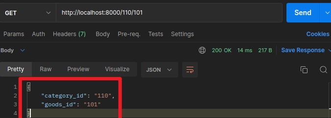
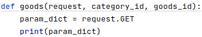
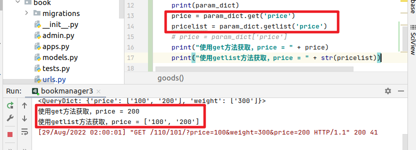
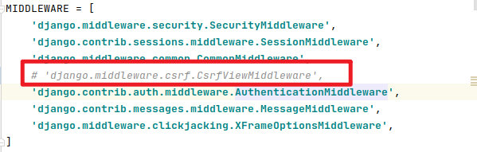
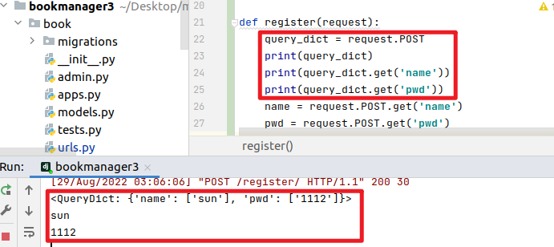
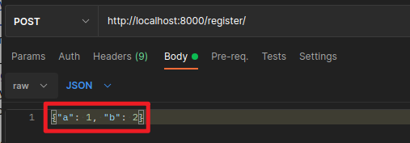
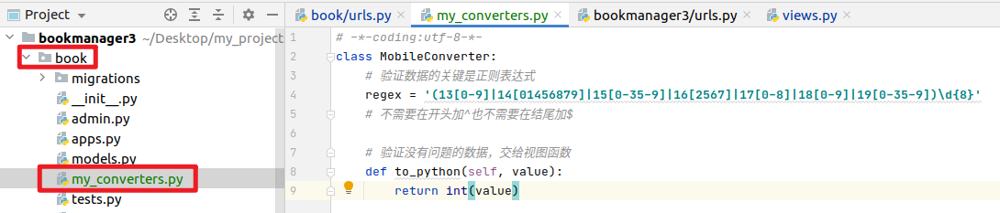

[TOC]

# HttpRequest对象
**利用HTTP协议向服务器传参有几种途径？**
- 提取**URL的特定部分**，如/weather/beijing/2018，可以在服务器端的路由中用正则表达式截取；
- **查询字符串**（query string)，形如key1=value1&key2=value2；
- 请求体（**body**）中发送的数据，比如表单数据、json、xml；
- 在http报文的头（**header**）中。

## 1. 获取URL路径中的参数
例如：`http://127.0.0.1:8000/18/188/`

修改应用的`urls.py`
```python
from django.urls import path
from book.views import goods
urlpatterns = [
    path('<category_id>/<goods_id>/',goods)
]
```

修改对应视图函数的参数: 参数的位置不能错
```python
from django.http import JsonResponse
def goods(request,category_id,goods_id):

    return JsonResponse({'category_id':category_id,'goods_id':goods_id})
```
  


## 2. 获取查询字符串
例如：`http://ip:port/path/path/.../?key=value&key1=value1&key=value2...`

**`request.GET`:获取所有参数**
  


`http://localhost:8000/110/101/?price=100&weight=300`
```python
<QueryDict: {'price': ['100'], 'weight': ['300']}>
```

`request.GET`返回的结果看着像是一个字典
当然，我们可以像访问`python`字典一样访问`request.GET`返回的结果
```python
price = param_dict.get('price')
或者
price = param_dict['price']
```

#### QueryDict
事实上，`HttpRequest`对象的**属性**`GET`、`POST`都是`QueryDict`类型的对象
与`python`字典不同，`QueryDict`类型的对象用来处理同一个键带有多个值的情况

例如：`http://localhost:8000/110/101/?price=100&weight=300&price=200`
此时
```python
<QueryDict: {'price': ['100', '200'], 'weight': ['300']}>
```
price中有两个值

- **方法**`get()`：根据键获取值
    如果一个键同时拥有**多个值**将**获取最后一个值**
    如果键不存在则返回`None`值，可以设置默认值进行后续处理
    `get('键',默认值)`

此时若仍使用`get`方法获取`price`，发现只能够获取最后一个值`200`

- **方法**`getlist()`：根据键获取值
    值以列表返回，可以获取指定键的所有值
    如果键不存在则返回空列表[]，可以设置默认值进行后续处理
    `getlist('键',默认值)`

  


**重要：查询字符串不区分请求方式，即 假使客户端进行POST方式的请求，依然可以通过request.GET获取请求中的查询字符串数据。**

## 3. 请求体
请求体数据格式不固定，可以是表单类型字符串，可以是JSON字符串，可以是XML字符串，应区别对待。

可以发送请求体数据的请求方式有POST、PUT、PATCH、DELETE。

**Django默认开启了CSRF防护，会对上述请求方式进行CSRF防护验证，在测试时可以关闭CSRF防护机制**，方法为在settings.py文件中注释掉CSRF中间件，如：
  

### 3.1 表单类型 Form Data
前端发送的表单类型的请求体数据，可以通过`request.POST`属性获取，返回`QueryDict`对象。
  

### 3.2 非表单类型 Non-Form Data
**非表单类型的请求体数据，Django无法自动解析，可以通过`request.body`属性获取最原始的请求体数据，自己按照请求体格式（`JSON`、`XML`等）进行解析。`request.body`返回`bytes`类型。**

例如：请求体中的数据为
```json
{
    "a": 1,
    "b": 2
}
```
  

```python
def register(request):

    body = request.body # 使用request.body获取请求体原始数据
    print(body)
    # b'{"a": 1, "b": 2}'
    print("body的类型为： " + str(type(body)))
    # body的类型为： <class 'bytes'>
    print(str(body))
    # b'{"a": 1, "b": 2}'
    print(body.decode()) # 通过decode()方法，可以将Byte类型的原始数据转换为字符串类型
    # {"a": 1, "b": 2}
    print(type(body.decode()))
    # <class 'str'>

    import json
    body_dict = json.loads(body.decode())# 使用json.loads将JSON样式的字符串转换为python中的字典类型
    print(body_dict, type(body_dict))
    # {'a': 1, 'b': 2} <class 'dict'>
    print(body_dict['a'])
    # 1
    return JsonResponse({"body":str(body)})
```

**总结：**
- 使用`request.body`获取请求体原始数据，原始数据为`Byte`类型，无法直接使用
- 通过`decode()`方法，可以将`Byte`类型的原始数据转换为字符串类型
- 使用`json.loads()`将`JSON`样式的字符串转换为`python`中的字典类型,便于后续操作


## 4. 验证url中的参数
系统为我们提供了一些路由转换器位置在django.urls.converters.py
```python
DEFAULT_CONVERTERS = {
    'int': IntConverter(), # 匹配正整数，包含0
    'path': PathConverter(), # 匹配任何非空字符串，包含了路径分隔符
    'slug': SlugConverter(), # 匹配字母、数字以及横杠、下划线组成的字符串
    'str': StringConverter(), # 匹配除了路径分隔符（/）之外的非空字符串，这是默认的形式
    'uuid': UUIDConverter(), # 匹配格式化的uuid，如 075194d3-6885-417e-a8a8-6c931e272f00
}
```
我们可以通过以下形式来验证数据的类型
```python
path('<int:category_id>/<int:goods_id>/',goods),
```

### 自定义转换器
对于url：`http://127.0.0.1:8000/18500001111/`
默认的路由转换器中，没有专门用来匹配手机号的路由转换器。所以在使用path()实现需求时，就无法直接使用默认的路由转换器。如果默认的路由转换器无法满足需求时，我们就需要**自定义路由转换器**。
*在任意可以被导入的python文件中，都可以自定义路由转换器。*

1. 创建转换器类
    在book中创建my_converters.py
      

    在文件中创建自定义的转换器类
    ```python
    # 参考自带的int转换器
    class IntConverter:
        regex = '[0-9]+'

        # 验证没有问题的数据，交给视图函数
        def to_python(self, value):
            return int(value)

        # 将匹配结果用于反向解析传值时使用
        def to_url(self, value):
            return str(value)
    ```

    ```py
    # 定义自己的转换器类
    class MobileConverter:
        # 验证数据的关键是正则表达式
        regex = '(13[0-9]|14[01456879]|15[0-35-9]|16[2567]|17[0-8]|18[0-9]|19[0-35-9])\d{8}'
        # 不需要在开头加^也不需要在结尾加$

        # 验证没有问题的数据，交给视图函数
        def to_python(self, value):
            # 可以在此处对数据进行处理
            return int(value)
        
        # 将匹配结果用于反向解析传值时使用
        def to_url(self, value):
            return str(value)
    ```

2. 在`urls.py`（主路由）中注册自定义转换器
    导入转换器模块
    `from book.my_converters import MobileConverter`

    注册转换器——**一定要在使用之前注册转换器**
    ```python
    # register_converter(自定义路由转换器, '别名')
    register_converter(MobileConverter, 'mobile')
    ```
3. 使用自定义路由转换器
    `path('<int:category_id>/<mobile:goods_id>/', goods),`

## 5. 请求头
可以通过request.META属性获取请求头headers中的数据，request.META为字典类型。
常见的请求头如：
- CONTENT_LENGTH– The length of the request body (as a string).
- CONTENT_TYPE– The MIME type of the request body.
- HTTP_ACCEPT– Acceptable content types for the response.
- HTTP_ACCEPT_ENCODING– Acceptable encodings for the response.
- HTTP_ACCEPT_LANGUAGE– Acceptable languages for the response.
- HTTP_HOST– The HTTP Host header sent by the client.
- HTTP_REFERER– The referring page, if any.
- HTTP_USER_AGENT– The client’s user-agent string.
- QUERY_STRING– The query string, as a single (unparsed) string.
- REMOTE_ADDR– The IP address of the client.
- REMOTE_HOST– The hostname of the client.
- REMOTE_USER– The user authenticated by the Web server, if any.
- REQUEST_METHOD– A string such as"GET"or"POST".
- SERVER_NAME– The hostname of the server.
- SERVER_PORT– The port of the server (as a string).
  
具体使用如:
```python
def get_headers(request):
    print(request.META['CONTENT_TYPE'])
    return HttpResponse('OK')
```

## 6. 其他常用HttpRequest对象属性
- **method**：一个字符串，表示请求使用的HTTP方法，常用值包括：'GET'、'POST'。
- **user**：请求的用户对象。
- path：一个字符串，表示请求的页面的完整路径，不包含域名和参数部分。
- encoding：一个字符串，表示提交的数据的编码方式。
    - 如果为None则表示使用浏览器的默认设置，一般为utf-8。
    - 这个属性是可写的，可以通过修改它来修改访问表单数据使用的编码，接下来对属性的任何访问将使用新的encoding值。
- FILES：一个类似于字典的对象，包含所有的上传文件。