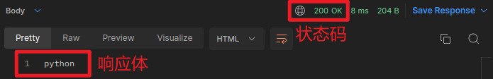
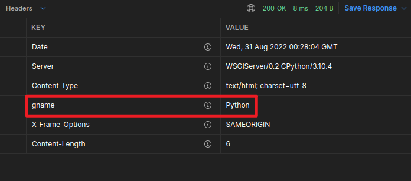
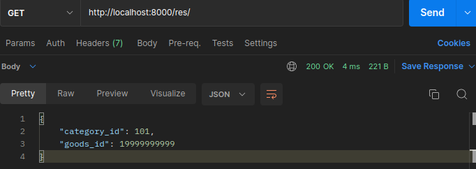

[TOC]
# HttpResponse对象
视图在接收请求并处理后，必须返回`HttpResponse`对象或子对象。
**`HttpRequest`对象由Django创建，`HttpResponse`对象由开发人员创建。**

## 1 HttpResponse
可以使用django.http.HttpResponse来构造响应对象。
```python
HttpResponse(content=响应体, content_type=响应体数据类型, status=状态码)
```

也可通过HttpResponse对象属性来设置响应体、响应体数据类型、状态码：

- content：表示返回的内容。
- status_code：返回的HTTP响应状态码。

响应头可以直接将HttpResponse对象当做字典进行响应头键值对的设置：
```python
response = HttpResponse()
response['itcast'] = 'Python'  # 自定义响应头Itcast, 值为Python
```

示例：
```python
from django.http import HttpResponse

def response(request):
    return HttpResponse('python', status=400)
    或者
    response = HttpResponse('python')
    response.status_code = 200
    response['gname'] = 'Python'
    return response
```

  
  

## 2 HttpResponse子类
Django提供了一系列HttpResponse的子类，可以快速设置状态码
```python
HttpResponseRedirect 301
HttpResponsePermanentRedirect 302
HttpResponseNotModified 304
HttpResponseBadRequest 400
HttpResponseNotFound 404
HttpResponseForbidden 403
HttpResponseNotAllowed 405
HttpResponseGone 410
HttpResponseServerError 500
```

## 3 JsonResponse
若要返回json数据，可以使用JsonResponse来构造响应对象，作用：

- 帮助我们将数据转换为json字符串
- 设置响应头Content-Type为application/json
```python
from django.http import JsonResponse

def response(request):
    return JsonResponse({'city': 'beijing', 'subject': 'python'})
```
## 4 redirect重定向
```python
from django.shortcuts import redirect

def response(request):
    return redirect('/101/19999999999/')
```
**不建议使用上面的绝对路径，重定向的时候建议使用命名空间进行反向解析**
  

