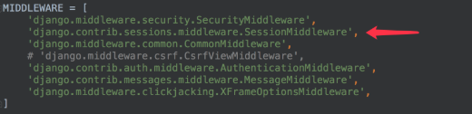
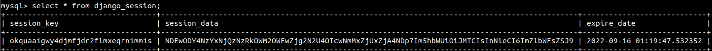
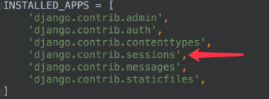
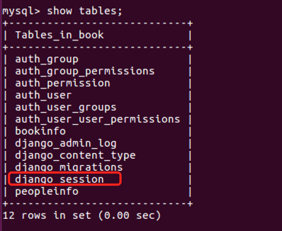
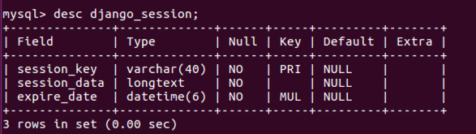

[TOC]

# Session
## 1 启用Session
Django项目默认启用Session。
可以在settings.py文件中查看，如图所示
  
如需禁用session，将上图中的session中间件注释掉即可。

## 2 Session操作
通过HttpRequest对象的session属性进行会话的读写操作。
##### 1） 以键值对的格式写session。
```py
request.session['键']=值
```
##### 2）根据键读取值。
```py
request.session.get('键',默认值)
```
##### 3）清除所有session，在存储中删除值部分。
```py
request.session.clear()
```
##### 4）清除session数据，在存储中删除session的整条数据。
```py
request.session.flush()
```
##### 5）删除session中的指定键及值，在存储中只删除某个键及对应的值。
```py
del request.session['键']
```
##### 6）设置session的有效期
```py
request.session.set_expiry(value)
```
- 如果value是一个**整数**，session将在value秒没有活动后过期。
- 如果value为**0**，那么用户session的Cookie将在用户的浏览器**关闭时过期**。
- 如果value为**None**，那么session有效期将采用系统默认值， **默认为两周**，可以通过在settings.py中设置`SESSION_COOKIE_AGE`来设置全局默认值。


```py
def sSession(request):
    request.session['name'] = 'LL'
    request.session['sex'] = 'female'
    
    return HttpResponse('ok')

def gSession(request):
    name = request.session.get('name')
    sex = request.session.get('sex')
    
    return JsonResponse({'name':name,'sex':sex})
```
  


## 3 存储方式
在settings.py文件中，可以设置session数据的存储方式(位置：随便挑一行写就行)，可以保存在数据库、本地缓存等。

### 3.1 数据库
存储在数据库中，如下设置可以写，也可以不写，这是默认存储方式。
```py
SESSION_ENGINE='django.contrib.sessions.backends.db'
```

如果存储在数据库中，需要在项INSTALLED_APPS中安装Session应用。
  
数据库中的session表如图所示
  
session表结构如下
  
由表结构可知，操作Session包括三个数据：键，值，过期时间。

### 3.2 本地缓存
存储在本机内存中，如果丢失则不能找回，比数据库的方式读写更快。
```py
SESSION_ENGINE='django.contrib.sessions.backends.cache'
```

### 3.3 混合存储
优先从本机内存中存取，如果没有则从数据库中存取。
```py
SESSION_ENGINE='django.contrib.sessions.backends.cached_db'
```

### 3.4 Redis
在redis中保存session，需要引入第三方扩展，我们可以使用django-redis来解决。
[文档](https://django-redis-chs.readthedocs.io/zh_CN/latest/)

##### 1） 安装扩展
安装前：
```log
(py3_django) sun@ubuntu20:~/Desktop/my_projects/Django_basic/bookmanager3$ pip list
Package     Version
-------     -------
Django      2.2.5
mysqlclient 2.1.1
pip         22.2.2
pytz        2022.1
setuptools  63.2.0
sqlparse    0.4.2
wheel       0.37.1
```

安装扩展
```py
pip install django-redis
```

安装后：
```log
(py3_django) sun@ubuntu20:~/Desktop/my_projects/Django_basic/bookmanager3$ pip list
Package       Version
------------- -------
async-timeout 4.0.2
Deprecated    1.2.13
Django        2.2.5
django-redis  5.2.0
mysqlclient   2.1.1
packaging     21.3
pip           22.2.2
pyparsing     3.0.9
pytz          2022.1
redis         4.3.4
setuptools    63.2.0
sqlparse      0.4.2
wheel         0.37.1
wrapt         1.14.1
```

##### 2） 配置
在settings.py文件中做如下设置
```py
CACHES = {
    'default': {
        'BACKEND': 'django_redis.cache.RedisCache',
        'LOCATION': 'redis://127.0.0.1:6379/1',
        'OPTIONS': {
            'CLIENT_CLASS': 'django_redis.client.DefaultClient',
        }
    }
}
SESSION_ENGINE = 'django.contrib.sessions.backends.cache'
SESSION_CACHE_ALIAS = 'default'
```


