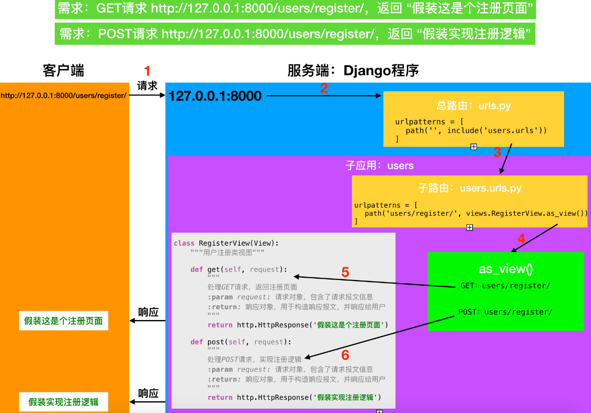

[TOC]

# 类视图
在Django中也可以使用类来定义一个视图，称为类视图。

本质上来说，基于类的视图允许你 使用 **不同的 类实例方法** 响应 **不同 HTTP 请求方法**，而不是在单个视图函数里使用有条件分支的代码。

因此在视图函数里处理 HTTP GET 的代码应该像下面这样：
```py
from django.http import HttpResponse

def my_view(request):
    if request.method == 'GET':
        # <view logic>
        return HttpResponse('result')
```

而在基于类的视图里，会变成：
```py
from django.http import HttpResponse
from django.views import View

class MyView(View):
    def get(self, request):
        # <view logic>
        return HttpResponse('result')
```

使用类视图可以将视图对应的不同请求方式以类中的不同方法来区别定义。如下所示
```py
from django.views.generic import View

class RegisterView(View):
    def get(self, request):
        return HttpResponse('假装是注册页面')

    def post(self, request):
        name = request.POST.get('name')
        return HttpResponse('欢迎注册： ' + name)
```

类视图的好处：
- **代码可读性好**
- **类视图相对于函数视图有更高的复用性**， 如果其他地方需要用到某个类视图的某个特定逻辑，直接继承该类视图即可

定义类视图需要**继承自**Django提供的父类`View`，可使用
`from django.views.generic import View`
或者
`from django.views.generic.base import View`
导入，定义方式如上所示。

**配置路由时，使用类视图的as_view()方法来添加。**
```py
urlpatterns = [
    # 视图函数：注册
    # path('register/', views.register),
    # 类视图：注册
    path('register/', views.RegisterView.as_view()),
]
```

  


