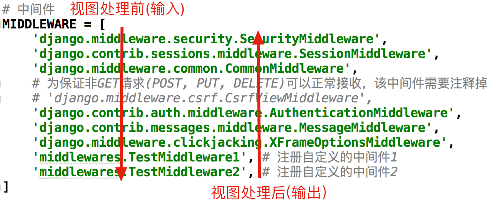

[TOC]

# 中间件
Django中的中间件是一个轻量级、底层的插件系统，可以介入Django的请求和响应处理过程，修改Django的输入或输出。中间件的设计为开发者提供了一种无侵入式的开发方式，增强了Django框架的健壮性。

我们可以使用中间件，在Django处理视图的不同阶段对输入或输出进行干预。

[中间件文档](https://docs.djangoproject.com/zh-hans/2.2/topics/http/middleware/)

## 1 中间件的定义方法
> - Django在中间件中预置了六个方法，这六个方法会在不同的阶段自动执行，对输入或输出进行干预。

### 1.1 初始化方法
- 启动Django程序，初始化中间件时，自动调用一次，用于确定是否启用当前中间件
    ```py
    def __init__(self, get_response=None):
        pass
    ```

### 1.2 处理请求前的方法：(重要)
- 在处理每个请求前，自动调用，返回`None`或`HttpResponse`对象
    ```py
    def process_request(self, request):
        pass
    ```

### 1.3 处理视图前的方法：（重要）
- 在处理每个视图前，自动调用，返回`None`或`HttpResponse`对象
    ```py
    def process_view(self, request, view_func, view_args, view_kwargs):
        pass
    ```
### 1.4 处理模板响应前的方法
- 在处理每个模板响应前，自动调用，返回实现了`render`方法的响应对象
    ```py
    def process_template_response(self, request, response):
        pass
    ```
### 1.5 处理响应后的方法：（重要）
- 在每个响应返回给客户端之前，自动调用，返回`HttpResponse`对象
    ```py
    def process_response(self, request, response):
        pass
    ```
### 1.6 异常处理
- 当视图抛出异常时，自动调用，返回一个`HttpResponse`对象
    ```py
    def process_exception(self, request,exception):
        pass
    ```

### 定义中间件
```py
# 导入中间件的父类
from django.utils.deprecation import MiddlewareMixin


class TestMiddleware1(MiddlewareMixin):
    """自定义中间件"""
    def process_request(self, request):
        """处理请求前自动调用"""
        print('process_request1 被调用')

    def process_view(self, request, view_func, view_args, view_kwargs):
        # 处理视图前自动调用
        print('process_view1 被调用')

    def process_response(self, request, response):
        """在每个响应返回给客户端之前自动调用"""
        print('process_response1 被调用')
        return response
```

定义好中间件后，需要在settings.py 文件中添加注册中间件
```py
MIDDLEWARE = [
    'django.middleware.security.SecurityMiddleware',
    'django.contrib.sessions.middleware.SessionMiddleware',
    'django.middleware.common.CommonMiddleware',
    # 'django.middleware.csrf.CsrfViewMiddleware',
    'django.contrib.auth.middleware.AuthenticationMiddleware',
    'django.contrib.messages.middleware.MessageMiddleware',
    'django.middleware.clickjacking.XFrameOptionsMiddleware',
    # 添加中间件
    'book.middleware.TestMiddleware1',  
]
```

定义一个视图进行测试
```py
def middleware(request):
    print('view 视图被调用')
    return HttpResponse('OK')
```

执行结果
```py
process_request1 被调用
process_view1 被调用
process_response1 被调用
```

## 2 多个中间件的执行顺序
- 在请求视图被处理前，中间件由上至下依次执行
- 在请求视图被处理后，中间件由下至上依次执行

  
